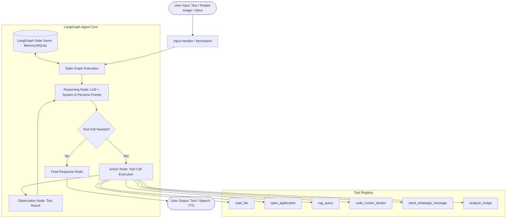

# Personal Agentic AI System — Master Project Plan (v1.1)

**Platform:** Windows 10/11 (WSL2 Backend)  
**Status:** Approved Architecture & Planning Phase  
**Orchestration Engine:** LangGraph (Stateful ReAct Loop)

---

## 0. Fundamental Clarifications & Principles

### Embedding & RAG Architecture
- **Pretrained Black-Box Embeddings:** Sentence-transformer models (`all-MiniLM-L6-v2`) are pretrained. Text goes in, fixed-dimension vectors come out. You will not design hidden layers, train neural weights, or tune embedding matrices.
- **RAG is Data Pipeline Engineering:** RAG quality depends on document loading, chunking boundaries (~200–500 tokens with overlap), clean metadata tagging, top-$k$ similarity search, and clean context injection separated from persona instructions.
- **Single Orchestration Framework:** LangGraph handles orchestration, looping, and state persistence. LlamaIndex is eliminated for v1 in favor of direct ChromaDB + `sentence-transformers` integration (or LangChain-compatible vector wrappers) to eliminate dual-framework abstraction friction.

---

## 1. Project Overview & Capabilities

A personal agentic assistant designed for Windows that operates through a single **Reasoning $\rightarrow$ Action $\rightarrow$ Observation (ReAct)** loop:

1. **OS-Level Process & File Control:** Launch Windows applications (`os.startfile` / `subprocess.Popen`) and read/parse local workspace files (`.txt`, `.pdf`, `.docx`, `.xlsx`).
2. **Autonomous Coding Assistant:** Generates code, runs it in an isolated **Docker Desktop container (WSL2)**, generates test assertions, inspects stdout/stderr, and iteratively debugs itself.
3. **Personal RAG Memory with Switchable Persona:** Answers personal questions from local notes and documents without losing persona tone (switchable between "Friend" and "Study Partner").
4. **Dual-Track Vision Capabilities:** 
   - **Direct Multimodal Input:** Natively analyzes pasted/attached images passed by the user.
   - **Disk-Based Vision Tool (`analyze_image`):** Dynamically inspects local images/screenshots on disk when needed mid-task.
5. **WhatsApp Web Automation:** Persistent Playwright browser session with session-state caching and automated QR-detection alerts.
6. **Voice Interface (Later Phase):** Local speech-to-text (Whisper) and text-to-speech (`pyttsx3`) routed directly through the unified message handler.

---

## 2. Non-Negotiable Ground Rules

1. **Build the Core ReAct Loop First:** Get Phase 1 boringly reliable with basic tools before touching RAG, code execution, WhatsApp, vision, or voice.
2. **One Orchestration Stack:** LangGraph is the sole state graph manager. No overlapping agent layers (`smolagents`, LlamaIndex agent runners).
3. **Mandatory Docker Sandboxing for Code Execution:** Generated code **never** executes directly in a raw host Python subprocess. All arbitrary code runs in an isolated throwaway Docker container with no volume mounts to host root, capped CPU/RAM, and disabled network access unless explicitly approved.
4. **Code Quality by Test-Pass-Rate:** Exit code `0` is not proof of success. The coding agent must generate test cases/assertions and verify them before declaring a task finished.
5. **Independent Tool Testing:** Every tool must be unit-tested standalone with `pytest` before being wired into the LangGraph tool registry.
6. **Strict Definition of Done (DoD):** Never start Phase $N+1$ until Phase $N$ passes all DoD acceptance criteria.

---

## 3. Approved Tech Stack

| Layer | Choice | Rationale & Architectural Decisions |
| :--- | :--- | :--- |
| **Agent Orchestration** | `langgraph` + `langchain-core` | Purpose-built for stateful ReAct graphs, branching, cyclical loops, and interruptible state. |
| **State Persistence & Memory** | LangGraph `MemorySaver` (Dev) $\rightarrow$ `SqliteSaver` (Prod) | Decouples short-term conversation state from RAG knowledge; preserves multi-turn context across persona switches. |
| **Vector Database** | `ChromaDB` (Local persistent storage) | Lightweight, serverless, free, zero API cost, gitignored local persistence. |
| **Embeddings** | `sentence-transformers` (`all-MiniLM-L6-v2`) | Local execution, fast CPU inference, zero API cost. |
| **LLM (Agent Brain)** | Anthropic Claude API (3.5 Sonnet) or OpenAI API (GPT-4o) | Premier native tool calling, high reliability in JSON argument generation, multimodal vision. |
| **Code Execution Sandbox** | **Docker Desktop (WSL2)** *(Fallback: `e2b.dev`)* | Strict local container isolation; prevents LLM code from mutating host files or processes. |
| **OS File & Process Control** | Python standard library (`pathlib`, `subprocess`, `os`, `psutil`) | Reliable Windows process launching and path management. *Coordinate GUI automation (`pyautogui`) is deferred.* |
| **File Parsing** | `pdfplumber`, `python-docx`, `openpyxl` | Deterministic parsing of local office and PDF documents. |
| **WhatsApp Automation** | `playwright` (Chromium) | Persistent browser context with `storage_state.json` cookie/session preservation. |
| **Vision Processing** | Multimodal LLM API + `analyze_image` tool | Top-level image ingestion handled by multimodal prompt; local on-disk images analyzed via dedicated tool. |
| **STT / TTS (Phase 6)** | `openai-whisper` (local) + `pyttsx3` (local) | Completely free, local offline voice pipeline. |
| **Configuration & Secrets** | `.env` + `pydantic-settings` / `python-dotenv` | Strictly no hardcoded credentials; centralized configuration. |
| **Testing & Verification** | `pytest`, `pytest-mock` | Isolated unit testing and multi-tool integration testing. |

---

## 4. System Architecture



### Conversational Memory vs. Persona vs. RAG
1. **Conversation History (LangGraph Checkpointer):** Tracks turn-by-turn messages and agent states.
2. **Persona Switching:** Persona ("friend" vs. "study partner") modifies the **system instruction block** in the prompt dynamically without wiping or corrupting the ongoing message history.
3. **RAG Memory:** A dedicated tool (`rag_query`) that queries the vector database when historical or personal context is needed.

---

## 5. RAG Pipeline Architecture

```mermaid
flowchart LR
    subgraph Ingestion_Pipeline [1. Ingestion Pipeline (Offline / On-Demand)]
        RawFiles[Personal Docs: txt/md/pdf/docx] --> Reader[File Readers]
        Reader --> Chunking[Semantic Splitter: 200-500 Tokens, 50 Overlap]
        Chunking --> Meta[Metadata Enrichment: Source, Date, Tag]
        Meta --> Embed[sentence-transformers all-MiniLM-L6-v2]
        Embed --> Chroma[(ChromaDB Vector Store)]
    end

    subgraph Query_Pipeline [2. Query Pipeline (Runtime Tool Call)]
        AgentQuery[Agent rag_query Tool] --> EmbedQuery[Embed Query]
        EmbedQuery --> ChromaQuery[Vector Top-k Similarity Search k=3..5]
        ChromaQuery --> Rerank[Context Assembly & Filtering]
        Rerank --> FormattedContext[Observation: Reference Knowledge Chunks]
    end
```

> [!IMPORTANT]
> **Anti-Awkwardness Design:** Retrieved chunks are fed as *Reference Observations*. The system prompt explicitly instructs the LLM: *"Use retrieved personal facts naturally to inform your response; never quote raw document fragments or recite facts verbatim unless explicitly asked."*

---

## 6. Phased Implementation Roadmap

### Phase 0: Environment & Core Setup (Est. 1–3 Days)
- **Steps:**
  1. Set up Python 3.11+ virtual environment (`venv`).
  2. Verify Docker Desktop with WSL2 backend is running locally.
  3. Install core libraries: `langgraph`, `langchain-core`, `chromadb`, `sentence-transformers`, `python-dotenv`, `pytest`.
  4. Configure `.env` with LLM API keys and initialize Git repository with `.gitignore`.
- **Definition of Done (DoD):**
  - [ ] Standalone test script successfully calls the chosen LLM API and receives structured output.
  - [ ] Docker engine verified via `docker run hello-world` executed from Python `subprocess`.
  - [ ] Clean repo initialized with zero hardcoded credentials.

---

### Phase 1: Core Agent Loop (The MVP) (Est. 1–2 Weeks)
Build the foundational LangGraph ReAct state graph with exactly 3 deterministic tools:
1. `read_file(path: str)`: Reads `.txt`, `.md`, `.pdf`, `.docx` inside an approved workspace path.
2. `open_application(app_name: str)`: Scoped strictly to process launching via `subprocess.Popen` or `os.startfile`. (No coordinate clicking).
3. `write_code_file(filepath: str, code_content: str)`: Saves generated code to disk.

- **LangGraph State:**
  - Implement `MessagesState` with in-memory checkpointer (`MemorySaver`).
  - Cap loop iterations at 8 to prevent infinite execution.
  - Implement structured logging for Reasoning $\rightarrow$ Action $\rightarrow$ Observation cycles.
- **Definition of Done (DoD):**
  - [ ] All 3 tools pass 100% of unit tests with `pytest`.
  - [ ] The agent correctly selects and executes tools for single-step requests 9/10 times across 10 varied prompts.
  - [ ] The agent successfully sequences two tools back-to-back (e.g., read a file, then open an application).
  - [ ] Missing files or invalid app names return structured error observations without crashing the agent.

---

### Phase 2: Personal RAG Memory & Persona Modes (Est. 1–2 Weeks)
- **Steps:**
  1. Build chunker (`chunking.py`), embedder (`embeddings.py`), and storage wrapper (`ChromaDB`).
  2. Index a personal dataset (notes, background facts, hobbies, preferences).
  3. Build the `rag_query(query: str)` tool.
  4. Create switchable prompt templates: `persona_friend.py` and `persona_study.py`.
- **Definition of Done (DoD):**
  - [ ] For 10 benchmark questions about user facts, retrieval fetches the target chunk in the top-3 results at least 8/10 times.
  - [ ] Switching persona alters tone noticeably while preserving factual accuracy and conversation continuity.
  - [ ] `rag_query` is added to Phase 1's tool registry without regressing core agent tools.

---

### Phase 3: Autonomous Coding Agent (Docker Sandboxed) (Est. 2–3 Weeks)
Upgrade `write_code_file` into an iterative development loop:
- **Sandbox Architecture:**
  - Launch a lightweight Docker container (e.g., `python:3.11-slim`).
  - No host root volume mounts; isolated ephemeral workspace directory.
  - Capped resources: max 1 CPU core, 512MB RAM, no network access.
- **Mandatory Self-Testing Loop:**
  - Agent generates target code **and** 2–3 specific test assertions.
  - Executes test suite inside Docker.
  - Captures stdout, stderr, and exit codes.
  - If tests fail: agent observes stderr $\rightarrow$ diagnoses error $\rightarrow$ rewrites code $\rightarrow$ re-executes (max 3 revision iterations).
- **Definition of Done (DoD):**
  - [ ] Given 10 standard algorithm or script tasks, the agent produces code that passes its own generated tests at least 7/10 times without human intervention.
  - [ ] Agent successfully fixes its own syntax/runtime bugs across at least 2 consecutive retry iterations.
  - [ ] Security boundary test passes: Deliberate destructive prompts (e.g., `import os; os.system('rm -rf /')` or modifying Windows host files) are contained inside Docker.

---

### Phase 4: WhatsApp Automation (Persistent Playwright) (Est. 3–5 Days)
- **Steps:**
  1. Maintain a persistent Playwright Chromium browser instance initialized at agent startup.
  2. Persist authentication credentials in `data/whatsapp_session/storage_state.json`.
  3. Implement `send_whatsapp_message(contact_name: str, message: str)`.
  4. Inspect the DOM for QR code elements before attempting message dispatch. If found, return: *"WhatsApp session expired — please scan QR code."*
- **Definition of Done (DoD):**
  - [ ] Successfully sends messages to an existing contact 8/10 times.
  - [ ] Unfound contact or network timeout returns a polite error observation, never crashing the agent process.
  - [ ] Documented known fragility warnings in `README.md`.

---

### Phase 5: Vision Integration (Dual-Track) (Est. 1 Week)
- **Track 1 (Multimodal User Ingestion):** User sends an image via chat $\rightarrow$ Input Handler encodes it directly into the LLM context block.
- **Track 2 (Agent Tool Inspection):** Implement `analyze_image(image_path: str, question: str)` for on-disk files.
- **Definition of Done (DoD):**
  - [ ] Agent accurately extracts text or analyzes diagrams from both direct chat uploads and local file paths.
  - [ ] Tested across 5 distinct formats: screenshots, UI mockups, handwritten notes, photo receipts, system diagrams.

---

### Phase 6: Voice Interface (Local Whisper & TTS) (Est. 1–2 Weeks)
- **Steps:**
  1. Push-to-talk audio recording via `sounddevice` or `pyaudio`.
  2. Local transcription using `openai-whisper` (`base` or `small` model).
  3. Speech synthesis via `pyttsx3` (fast, free, local).
  4. Voice input directly feeds into the standard text `Input Handler`.
- **Definition of Done (DoD):**
  - [ ] Voice input successfully converted to text and routed through the exact same LangGraph pipeline.
  - [ ] End-to-end response latency under 5 seconds for single-tool tasks.

---

### Phase 7 (Deferred / Post-v1): GUI Desktop Automation
- Reserved for future development: coordinate clicking, screen OCR inspection, and window automation with `pyautogui` / `pygetwindow`.

---

## 7. Project Folder Structure

```text
personal-agent/
├── .env                          # API keys and local config (gitignored)
├── .gitignore
├── requirements.txt
├── README.md
├── Dockerfile.sandbox            # Minimal container for Phase 3 code runner
├── config/
│   └── settings.py               # Pydantic BaseSettings for config validation
├── agent/
│   ├── graph.py                  # LangGraph StateGraph definition & routing
│   ├── state.py                  # Agent state schema definition
│   └── prompts/
│       ├── system_prompt.py      # Base instruction & safety guidelines
│       ├── persona_friend.py     # Casual / friend tone prompt
│       └── persona_study.py      # Academic / study partner prompt
├── tools/
│   ├── file_tools.py             # read_file, write_file
│   ├── app_control_tools.py      # open_application (process launch)
│   ├── code_agent_tools.py       # docker-sandboxed execution & test runner
│   ├── rag_tools.py              # rag_query tool
│   ├── whatsapp_tools.py         # persistent Playwright WhatsApp automation
│   └── vision_tools.py           # analyze_image tool for disk assets
├── rag/
│   ├── ingest.py                 # File loader pipeline
│   ├── chunking.py               # Semantic chunker implementation
│   ├── embeddings.py             # SentenceTransformers wrapper
│   └── store.py                  # ChromaDB client management
├── voice/
│   ├── stt.py                    # Local Whisper transcription
│   └── tts.py                    # pyttsx3 speech synthesis
├── data/
│   ├── personal_corpus/          # Raw personal notes & documents
│   ├── whatsapp_session/         # Playwright storage_state.json (gitignored)
│   └── sqlite_checkpoints/       # SqliteSaver conversational state (gitignored)
├── vector_store/                 # ChromaDB persistent directory (gitignored)
├── logs/                         # Structured JSON agent execution logs
├── tests/
│   ├── manual_test_log.md        # Qualitative and demo test run notes
│   ├── unit/                     # Standalone tool and component unit tests
│   │   ├── test_file_tools.py
│   │   ├── test_docker_sandbox.py
│   │   └── test_rag_retrieval.py
│   └── integration/              # Full LangGraph graph flow tests
│       └── test_agent_graph.py
└── main.py                       # CLI / Entrypoint interface
```

---

## 8. Risk Management Matrix

| Risk Scenario | Likelihood | Impact | Mitigation Strategy |
| :--- | :--- | :--- | :--- |
| **Destructive Code Execution** | Medium | Critical | Mandatory Docker container isolation with restricted privileges and memory limits. |
| **WhatsApp Selector Changes** | High | Medium | Check selectors dynamically; trap errors cleanly; isolate from core agent stability. |
| **Tool Argument Hallucination** | Medium | High | Strict Pydantic schemas on tool arguments; validate types before invocation. |
| **RAG Fact Stiffening Tone** | Medium | Medium | Separate factual context injection from persona instructions; prompt against robotic quoting. |
| **Infinite Agent Looping** | Low | High | Hard recursion limit (max 8 steps) enforced in LangGraph edge conditions. |
| **Session Invalidation** | Medium | Low | Check for QR code presence before sending WhatsApp messages; emit human-readable re-auth prompts. |

---

## 9. Definition of Project Done (v1 Release)

You can confidently declare **v1 Complete** when:
1. **Phases 1, 2, and 3 are rock-solid:** Process launching, file reading, RAG persona chat, and Docker-sandboxed code generation with self-testing all pass their respective DoD checklists.
2. **Phase 4 (WhatsApp) functions with documented limits:** Clear error handling when sessions expire or DOM selectors change.
3. **Phase 5 (Vision) handles basic inspection:** Works cleanly for both attached images and on-disk files.
4. **Phase 6 (Voice) is either working or cleanly deferred:** Voice input works or is cleanly flagged as future work without breaking text workflows.
5. **Live Unscripted Demo:** You can run an unscripted multi-turn CLI session demonstrating Phases 1–3 seamlessly without manual interventions or crashes.
